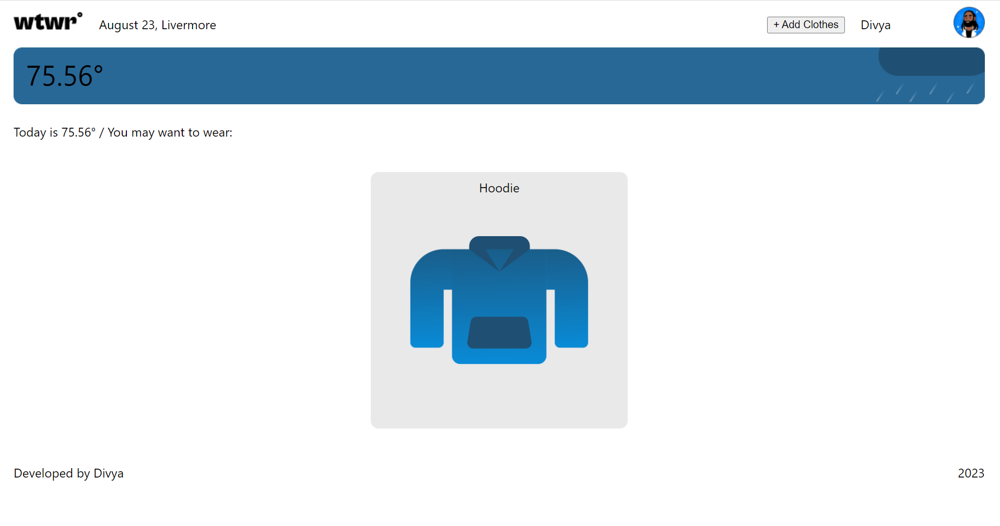
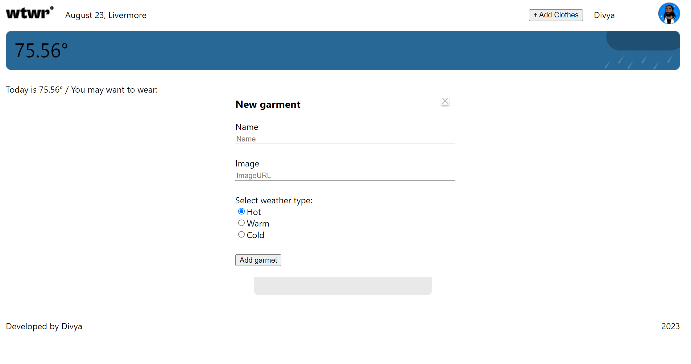
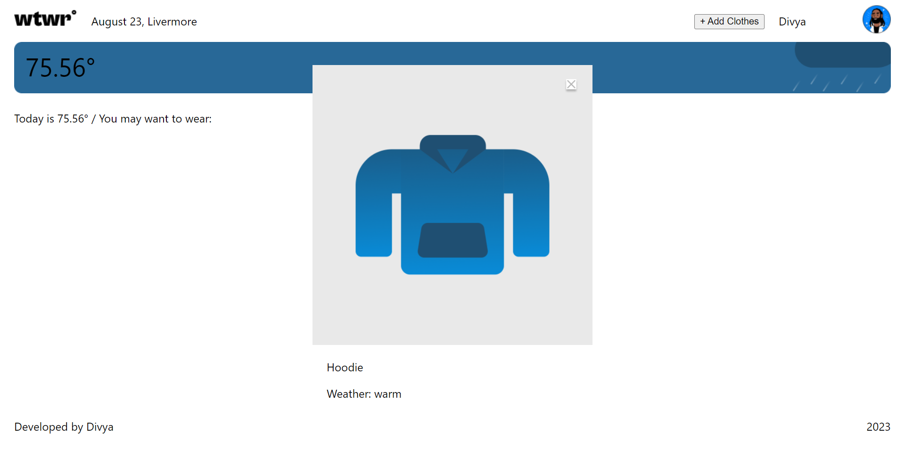

# Project 3: Around The U.S.

### Overview

- Intro
- Figma
- Website Link
- Images

### Intro

This Webpage is designed using React JS. Purpose of the webpage is to display garments to wear based on the weather condition in a city from United States.

Technologies Used: React JS

### Figma

- [Link to the project on Figma](https://www.figma.com/file/F03bTb81Pw8IDPj5Y9rc5i/Sprint-10-%7C-WTWR?type=design&mode=design)

### Website Link

- https://divyaaa1812.github.io/se_project_react

### Images

Desktop View:

